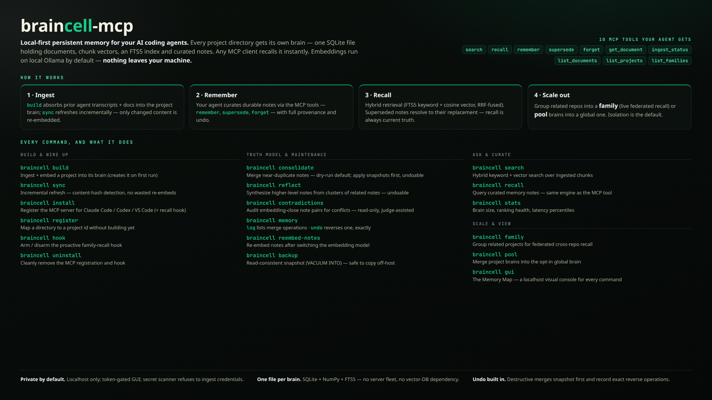
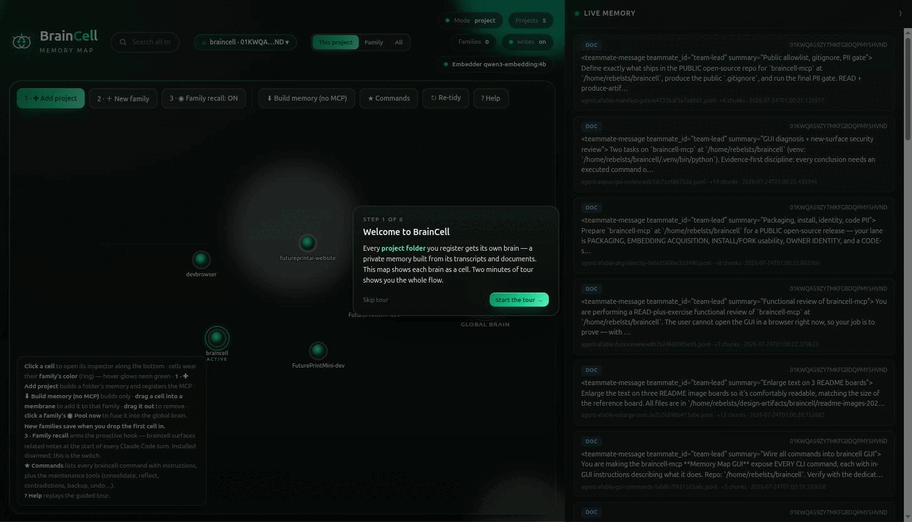
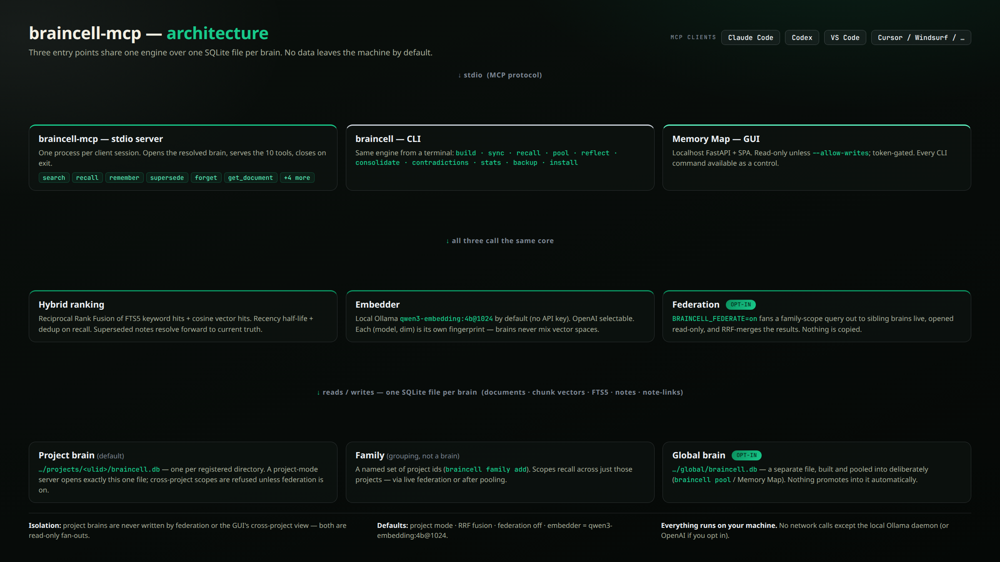
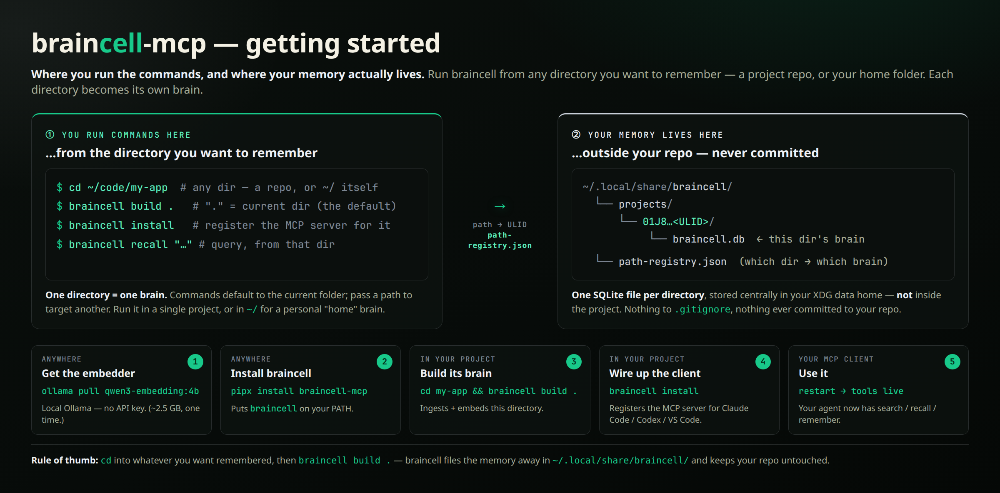
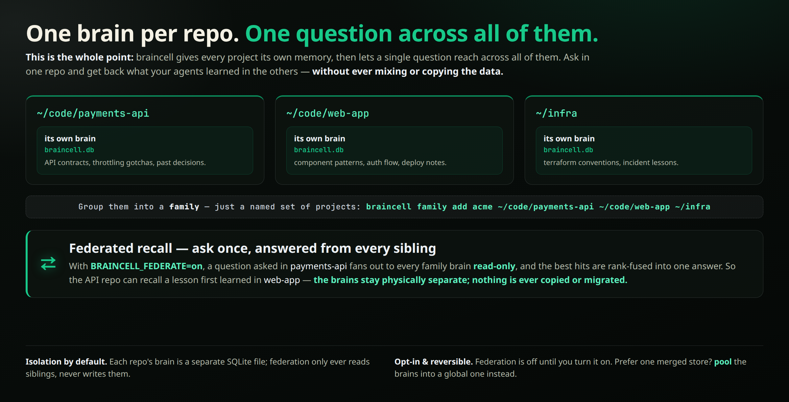
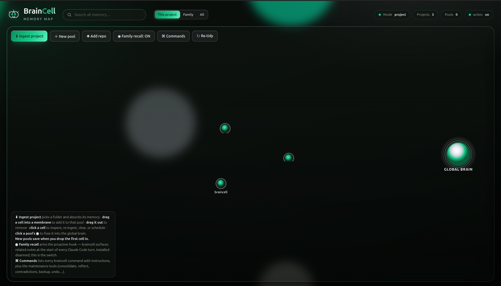
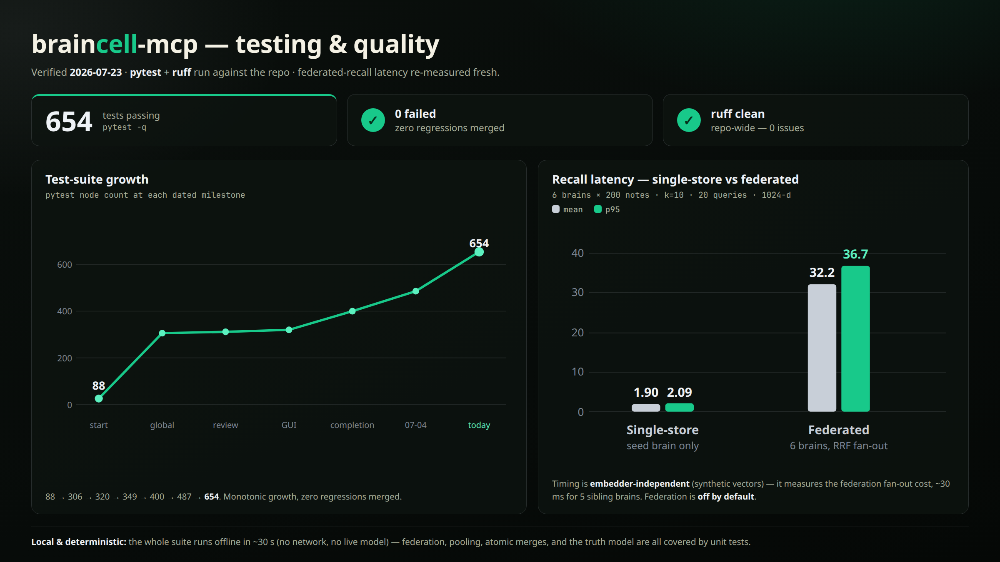

# braincell-mcp

A local-first persistent-memory MCP server.

Runs entirely on your machine over SQLite. No data leaves the box by default. It gives an MCP
client a per-project (or shared) "brain": ingested documents and transcripts searchable with a
hybrid of vector similarity and full-text keyword ranking, plus curated memory notes you can
`remember`, `recall`, `supersede`, and `forget`.



MCP clients (Claude Code, Codex, VS Code, …) talk to one of three entry points — the FastMCP
stdio server, the `braincell` CLI, or the Memory Map GUI — all backed by the same engine. That
engine ranks results with a hybrid fusion of FTS5 keyword search and cosine vector search over a
local Ollama embedder (`qwen3-embedding:4b` @ 1024-d by default), can optionally fan a family-scoped query out
to sibling project brains live and read-only (`BRAINCELL_FEDERATE=on`), and stores everything as
one SQLite file per project brain by default — with a separate opt-in global brain, and families
that are just a named grouping of project IDs, not a brain of their own.

## What's new in v0.2



v0.2 makes braincell far easier to get into, and sharper once you're in.

**New onboarding**
- **`braincell start`** — one command launches the Memory Map and, on a first run, an 8-step guided tour.
- **Numbered happy path** — the toolbar walks you through *1 · Add project → 2 · New family → 3 · Family recall*; **? Help** replays the tour anytime.
- **Embedder preflight** — `start` checks Ollama and the model first and prints the exact fix if it's down, so you never hit a broken build.
- **Plain `pip install braincell-mcp`** now ships the GUI — no `[gui]` extra needed.

**New features**
- **Active-project memory** — switch which project's memory the map is viewing, with honest per-project counts; sibling projects open read-only.
- **Live Memory feed** — a scrollable rail streams new notes and ingested documents as plain text as they land.
- **MCP status & controls** — Register / Deregister the MCP from the GUI, with an honest "reconnect via `/mcp`" note.
- **Embedder gate** — building while the embedder is down no longer silently produces NULL-embedded chunks.
- **Bottom-dock inspector**, **family-colored cells**, and a **durable GUI token** (restarts stop orphaning open tabs).

## How it works



**A "brain" is one SQLite file.** Each registered project gets its own `braincell.db` holding
everything: `bc_documents` / `bc_chunks` / `bc_chunks_fts` for ingested documents and agent
transcripts (chunked to ~2000 characters — see `transcript_ingest.py`), `memory_notes` /
`memory_fts` for curated memory (the `remember` / `recall` / `supersede` / `forget` surface), a
`bc_note_links` graph table connecting related notes, plus `schema_version` and
`embed_fingerprint` guard tables. A single SQLite connection per store means cross-table writes
and backups (`braincell backup`, SQLite `VACUUM INTO`) are atomic.

**Vector search is brute-force NumPy cosine, on purpose.** Every embedding is L2-normalised at
write time (`embed.py`), so a plain dot product over the stored float32 vectors is cosine
similarity — no index structure needed. `store.py` decodes all of a project's chunk/note vectors
into one matrix and takes the top-k via `argpartition` (O(N), not a full sort). At braincell's
scale (a handful to tens of thousands of vectors per project) flat search beats ANN, so an
`sqlite-vec` backend is deliberately deferred behind the dependency-supply-chain gate — vector
search is instrumented (`vec_search_p95_ms`) and `braincell stats` tells you if you've actually
crossed the point where ANN would pay off (default trigger 50 ms p95).

**Keyword search is SQLite FTS5**, with an automatic `LIKE`-scan fallback if the local SQLite
build lacks the FTS5 extension.

**Hybrid ranking fuses the two lists.** The default is Reciprocal Rank Fusion (rank-only, tuning
free); a convex-combination fusion (`BRAINCELL_FUSION=cc`) that blends normalized score magnitudes
is available when you're willing to tune an alpha. Curated-memory `recall` additionally blends the
fused score with a confidence factor and a recency half-life decay (default 90 days — older notes
fade but never disappear), then greedy-dedupes near-duplicate notes (stored-vector cosine above
0.95) so the same lesson recorded twice doesn't crowd out other results. An optional local
reranker (`BRAINCELL_RERANK=ollama`) can re-score the fused top-M window with a small chat model
before truncating to k — it's abandoned in favor of the fused order if the model can't score every
candidate.

**Recall answers with current truth.** A note that has been superseded is never returned as the
answer. It still takes part in *matching* — the retired wording is usually what a stale query
rhymes with — but a superseded hit is then resolved along `superseded_by` to the note that replaced
it, and that note is returned in its place, tagged `retrieval_origin='resolved'` with the retired
note attached as `history`. So asking "should we use Redis?" surfaces the decision that replaced
it, even when the replacement never mentions Redis; if the whole chain ends in a retraction, you
get nothing rather than a revived answer. Pass `include_superseded=true` (or `braincell recall
--include-superseded`) for the historical view — what the project used to believe, ranked on its
own merits. The Memory Map GUI uses that view: it is a history browser, not an answer engine.

**The note-links graph** (`bc_note_links`) is built automatically: writing a note compares its
vector against a project's recent notes and inserts bidirectional "related" links above a cosine
threshold. Recall can optionally pull a bounded number of linked "also-see" notes into the tail of
its results (`BRAINCELL_LINK_EXPAND`), tagged as expansions so they never displace a direct hit.

**Embeddings and fingerprinting** (`embed.py` / `embed_spec.py`): the provider (local Ollama or
hosted OpenAI), model, and dimension are read from environment variables into a single
`(provider, model, dim)` fingerprint. That fingerprint is stamped into every store the first time
it's opened, and every subsequent open compares against it — a provider, model, or dimension
change is refused loudly (never silently mixes vector spaces) until you run `braincell build
--reembed`.

**Scope resolution happens in `server.py`.** `_resolve_scope` / `_resolve_filter` decide what a
`search`/`recall` call is allowed to touch: `scope='self'` (the default) resolves to the
configured project; an explicit `project` or `projects` argument overrides scope entirely;
`scope='family'` and `scope='all'` require `BRAINCELL_MODE=global` and raise otherwise — with one
opt-in exception for federation, below.

**Federation (`federate.py`) answers family-scoped recall without a shared brain.** With
`BRAINCELL_FEDERATE=on`, a project-mode server resolves the calling project's family, opens every
sibling's `braincell.db` **read-only** (a `mode=ro` URI plus `PRAGMA query_only`, reading the live
WAL without ever migrating or writing it), runs the same `recall`/`search` against each concurrently
(bounded to 8 at a time), and Reciprocal-Rank-Fuses the per-brain ranked lists — weighting the
calling project's own list via `BRAINCELL_RRF_WEIGHT_ACTIVE` if you want it to win close ties. A
sibling built with a different embedder fingerprint contributes keyword-only hits (never scored
against a foreign vector space) unless `BRAINCELL_FEDERATE_STRICT=on` skips it outright; a corrupt,
locked, or schema-mismatched sibling is skipped and logged, never fatal to the query.

**Pooling (`pool.py`) is the alternative: a physical merge, no re-embedding.** `braincell pool`
copies documents, chunks, and notes from each project brain straight into the global brain's
SQLite file, reusing the stored float32 vectors verbatim instead of re-ingesting and re-embedding
everything. It's idempotent (already-copied rows are skipped on a re-run), refuses to pool a
source whose embedder fingerprint doesn't match the global brain's, remaps supersede chains and
note-links to the new IDs, and rebuilds the FTS indexes once at the end.

**Projects and families are just a path registry** (`project_registry.py`): `path-registry.json`
maps an absolute repo path to a project ID (encode-direction only — a project's `~/.claude/projects`
dirname is matched against this registry, never reverse-decoded), and `families.json` maps a
family name to a list of member paths. A family is a naming convenience over that registry, not a
brain of its own — resolving a project's family (`resolve_family_ulids`) is a set lookup, and an
unregistered member simply contributes nothing yet (lazy-link).

**Three entry points, one engine.** The MCP stdio server (`server.py`, FastMCP) exposes the tools
listed below; the CLI (`cli.py`) wraps the same engine for scripting, maintenance, and one-shot
recall; the Memory Map GUI (`gui.py` + `gui_template.py`) is a FastAPI app serving a self-contained
vanilla-JS/SVG canvas over the identical `Store` protocol. Recall in particular is centralized in
one `recall_notes` orchestration function so the MCP tool and `braincell recall` produce
byte-identical rankings.

## Install

### Prerequisites — a local embedder

braincell embeds locally with [Ollama](https://ollama.com) by default, so **no API key is
required**. Ollama is the only external dependency; before installing braincell, get it running
and pull the default embedding model:

```bash
# 1. Install Ollama — see https://ollama.com/download (Linux one-liner shown):
curl -fsSL https://ollama.com/install.sh | sh

# 2. Pull the default embedder (~2.5 GB). Ollama serves it on localhost:11434:
ollama pull qwen3-embedding:4b
```

Prefer hosted embeddings? Set `BRAINCELL_EMBED_PROVIDER=openai` and `OPENAI_API_KEY` instead — no
Ollama needed. Either way, the model/provider is stamped into each brain on first build, so switching
later requires `braincell build --reembed`.

### braincell itself

```bash
pip install braincell-mcp      # or `pipx install braincell-mcp`; `pip install .` from a checkout
```

This puts three commands on your PATH:

- `braincell` — the CLI (start, build, search-tuning, maintenance, install).
- `braincell-mcp` — the MCP server (stdio).
- `braincell-map` — opens the Memory Map in your browser (global brain, writable).

The Memory Map GUI ships in the base install (no extra needed), and the default embedder is
a local Ollama model, so no API key is required out of the box.

## Start

```bash
cd /path/to/your/project       # any folder you work in — no git required
braincell start
```

One command: `braincell start` verifies the embedder first (printing the exact fix if
Ollama or the model is missing), then opens the Memory Map for that project folder —
straight into a short guided tour on a first run. The tour's **✚ Add project** wizard
Builds the folder's memory, Registers the MCP server for your client, and optionally joins
a Family — ending with the reminder to reconnect your client (`/mcp` in Claude Code).
Run it again anytime: it reuses the already-running map instead of starting a second one.



Or run the same pieces individually:

```bash
braincell build .              # index the current project into its brain
braincell serve                # run the MCP server (or point your client at `braincell-mcp`)
braincell-map                  # open the interactive Memory Map (global brain)
```

## Connect it to Claude Code (terminal path)

Prefer the terminal to the map? One command wires braincell into Claude Code — it registers
the MCP server for the current project (via `claude mcp add`) and installs the optional
proactive family-recall hook:

```bash
braincell build .        # index the current project into its brain first
braincell install        # register the MCP server (+ install the hook, disarmed)
# restart Claude Code so it loads the server → the mcp__braincell__* tools light up
```

- `braincell install --global` registers against the shared global brain instead of a project.
- `braincell install --no-hook` registers the MCP server only.
- `braincell install --federate` also stamps `BRAINCELL_FEDERATE=on` into the server's env, so
  `recall`/`search` calls with `scope='family'` fan out across the project's family instead of
  raising. Off by default — see [Scope model](#scope-model) for what it unlocks.
- `braincell hook on` / `off` arms/disarms the proactive family-recall hook (off by default —
  it auto-surfaces related notes from sibling projects in a family each turn, and always
  requests federation for its own recall call regardless of `--federate`).
- `braincell uninstall` reverses it (removes the MCP registration and the hook).

### Other clients

`braincell install --client codex` and `--client vscode` register the MCP server with those
clients too (via `codex mcp add` / `code --add-mcp`). They get the `braincell` **tools only** —
the proactive hook is a Claude Code feature. `braincell uninstall --client codex` reverses
Codex; VS Code has no remove-MCP CLI, so removal there is a one-time manual step (the command
prints how). Cursor / Windsurf / others can point their MCP config at `braincell-mcp` directly.

## Adding a project

The full copy-paste sequence is `braincell build` → `braincell install --federate` →
`braincell family add` → restart your client. One caveat: family members only combine as real
vector search if built with the same embedder (mismatched siblings degrade to keyword-only).
The Memory Map GUI's **✚ Add project** wizard (below — opened via `braincell start`) walks the
same steps interactively if you'd rather not type commands.

## MCP tools

`search`, `recall`, `remember`, `forget`, `supersede`, `get_document`, `ingest_status`,
`list_documents`, `list_projects`, `list_families`.

## Scope model



braincell is **project-scoped by default, with an opt-in shared brain** — and there is no
automatic path between the two:

- **Project mode** (the default, `BRAINCELL_MODE=project`) gives each registered directory its
  own isolated brain in its own database file (`…/projects/<id>/braincell.db`). A project-mode
  server opens exactly one project's file, so it can only ever read and write that project's
  documents and notes. Cross-project scopes (`family`, `all`) are rejected in project mode.
- **Global mode** (`BRAINCELL_MODE=global`) is a *separate* brain in a *separate* file
  (`…/global/braincell.db`). It does not exist until you explicitly create it, and per-project
  brains only enter it when you explicitly **pool** them in (via `braincell pool` or the Memory
  Map). Related directories can be grouped into a **family** to scope recall across just those
  projects.

Nothing promotes a project into the global brain on its own: switching modes is a deliberate
environment/flag choice, the global brain must be built before it can be opened, and pooling is
always an operator action. Project isolation and the shared brain are two intentional modes, not
a boundary that leaks from one into the other.

**Cross-project recall without a shared brain (opt-in).** Set `BRAINCELL_FEDERATE=on` to answer a
`family`-scoped recall or search by querying each family member's brain live and rank-fusing the
results, instead of pooling them into the global brain. The per-project brains stay physically
separate and are opened read-only, so nothing is merged or copied. A project-mode Memory Map can do
the same by passing `federate=true` to its notes/search API — see the federation variables in
[Configuration](#configuration).

## The Memory Map (GUI)



`braincell start` (or `braincell gui`, or the one-click `braincell-map`) serves a
localhost-only interactive map, skinned in a dark emerald, ivory, and silver theme — a
near-black canvas with pale ivory text and emerald highlights. The header carries the
BrainCell wordmark and a "memory map" tag, a "Search all memory…" bar, and a row of status
chips (`Mode`, `Projects`, `Families`, a writes indicator, an embedder-status chip that
turns red — with a click-for-the-fix modal — when the local embedder is unreachable, and a
pulsing chip while a background build job is running). Below a small toolbar — the numbered
happy path `1 · ✚ Add project`, `2 · ＋ New family`, `3 · ◌ Family recall`, then
`⬇ Build memory (no MCP)`, `★ Commands`, `↻ Re-tidy`, and `? Help`, which replays the
guided tour — is the map itself, inside a rounded,
softly bordered stage: each registered project renders as a glowing emerald-green cell, families
render as membranes in their own hue, and the global brain — once built — renders as a
brighter central organism with a luminous silver core ringed in emerald. Drag a cell into a membrane
to add it to that family, drag it back out to remove it, click a cell to inspect, rebuild, clear, or
schedule its memory, and click a family's **◉ Pool now** to fuse that family into the global brain —
a new family saves the moment you drop the first cell into it. A legend in the corner spells out the
interactions.

- `braincell start` opens the map writable with a first-run guided tour (replay it anytime
  from **? Help**); `braincell gui` is read-only by default — pass `--allow-writes` to
  enable edits (forget notes, manage families, pool, build).
- **✚ Add project** wizard (writable mode) walks pick → build → register MCP → family in one
  guided flow: pick a folder (a native OS folder dialog is offered when available — zenity on
  Linux; it degrades automatically to the built-in server-side folder browser if zenity isn't
  installed or there's no display), build it, register the MCP server for a client
  (`POST /api/install`, with "Enable cross-project federation" checked by default), and
  optionally add it to a family — finishing with a reminder to restart your MCP client.
- **◉ Family recall** (writable mode) arms or disarms the proactive family-recall hook — the
  same switch as `braincell hook on|off`. The hook is installed *disarmed*, so this is what
  turns it on. Note it surfaces curated **notes** (what `remember` writes), not ingested
  transcript chunks, so a freshly built brain stays quiet until notes accumulate.
- **MCP status & controls** live in each cell's inspector: it shows whether the braincell
  MCP server is registered for that project folder, with **Register MCP** / **Deregister
  MCP** as the real on/off. There is deliberately no MCP-restart button — the server is a
  stdio subprocess owned by your MCP client, so restarting it means reconnecting in the
  client (`/mcp` in Claude Code); the inspector says so right where you'd look for one.
- Build is gated on the embedder: if Ollama is unreachable or the model isn't pulled, Build
  refuses with the exact fix instead of silently indexing without vectors (the header chip
  shows the same status at all times).
- One family caveat carries over from the CLI: members only fully participate in vector
  recall if built with the same embedder (mismatched siblings degrade to keyword-only).
- Even a read-only launch requires an access token (carried as `?t=` in the opened URL) so the
  project/family enumeration endpoints aren't open to any other local process or tab. The token
  is minted once and persisted (0600) per data namespace, so restarting the GUI keeps
  already-open tabs working; rotate it with `braincell gui --rotate-token`, or set
  `BRAINCELL_GUI_TOKEN` to use an explicit token instead (never written to disk).
- `braincell gui --install-launcher` adds a desktop icon and a **BrainCell Map** menu entry (Linux).
  Portable launchers for macOS/Linux/Windows live in `scripts/`.

## Testing & quality



The test suite currently sits at **875 passing tests** (`pytest -q`), and the package source
(`braincell/`) is ruff-clean. A dedicated benchmark (`scripts/federate_bench.py`, no live embedder
required — it uses synthetic unit vectors) measures the cost of opt-in federation: with 6 sibling
brains of 200 notes each, a single-store recall averages **1.90 ms** (p95 2.09 ms), while fanning
the same query out across the whole family averages **32.2 ms** (p95 36.7 ms) — roughly 6 ms per
extra sibling brain opened read-only, concurrently, and rank-fused. That overhead buys
cross-project recall without ever merging or writing another project's brain, and it's paid only
when you opt in with `BRAINCELL_FEDERATE=on`.

## CLI commands

| Command | Purpose |
|---|---|
| `start` | One-command launcher: embedder preflight, then the writable Memory Map (+ first-run guided tour). Reuses an already-running map on the same port instead of starting a second one. |
| `build` / `sync` | Ingest (or incrementally refresh) documents and transcripts into a brain. |
| `register` | Mint/confirm the project ULID (no ingest). |
| `serve` | Run the MCP stdio server. |
| `recall` | Recall curated memory notes from the CLI (same engine as the MCP `recall` tool). |
| `search` | Hybrid search over ingested documents and transcripts (same engine as the MCP `search` tool). `--rank hybrid\|semantic\|keyword` picks the ranking strategy; `--mode project\|global` picks the brain. |
| `install` / `uninstall` | Wire (or remove) braincell's MCP registration for a client (`--client claude\|codex\|vscode`), plus the Claude Code family-recall hook. `--federate` stamps `BRAINCELL_FEDERATE=on` so `scope='family'` fans out across the project's family (off by default). `--skills` also installs the packaged `/braincell-init` and `/braincell-sync` Claude Code skills into `~/.claude/skills` — never overwriting an existing skill of the same name. |
| `hook` | Arm (`on`) / disarm (`off`) / report (`status`) the proactive family-recall hook. |
| `gui` | Launch the Memory Map (`--install-launcher` to install the desktop icon). |
| `pool` | Merge existing per-project brains into the global brain, without re-embedding. |
| `family` | Manage project families (`add` / `rm` / `ls`). |
| `reembed-notes` | Backfill embeddings for older notes. |
| `consolidate` | Find and merge near-duplicate notes (dry-run by default; `--llm` for an Ollama-synthesized merge body). `--apply` snapshots the brain first and records an undoable operation. |
| `reflect` | Synthesize higher-level notes from clusters of related notes (dry-run by default; `--apply` writes and supersedes sources). `--apply` snapshots the brain first and records an undoable operation. |
| `contradictions` | Audit embedding-close active note pairs for contradictions (read-only, Ollama-judged; `--no-llm` lists candidate pairs without a judge). Resolution is always an explicit `supersede`/`forget` — there is deliberately no `--apply`. |
| `memory` | `log` lists recorded merge operations; `undo <n>` reverses one, restoring each note's exact pre-merge state. |
| `backup` | Snapshot the brain via SQLite `VACUUM INTO`. |
| `stats` | Show document/chunk counts and a vector-search p95 latency benchmark (informs the sqlite-vec adoption trigger). |

## Configuration

All settings are optional environment variables; the defaults preserve the standard behavior.

| Variable | Default | Meaning |
|---|---|---|
| `BRAINCELL_MODE` | `project` | `project` (isolated per repo) or `global` (one shared brain). |
| `BRAINCELL_DATA_NAMESPACE` | `braincell` | Data-directory namespace under `$XDG_DATA_HOME` — set to isolate a second, unrelated deployment on the same machine. |
| `BRAINCELL_FEDERATE` | `off` | `on` enables federated `scope='family'` recall/search in project mode: query each family member's brain live and rank-fuse, instead of pooling. |
| `BRAINCELL_FEDERATE_STRICT` | `off` | `on` skips family members built with a different embedder entirely; default includes them as keyword-only (never mixes vector spaces). |
| `BRAINCELL_RRF_WEIGHT_ACTIVE` | `1.0` | Federated recall: RRF weight for the active project's own notes (>1.0 gives the working directory a prior). |
| `BRAINCELL_EMBED_PROVIDER` | `ollama` | Embedding provider: `ollama` (local) or `openai`. |
| `BRAINCELL_EMBED_MODEL` | `qwen3-embedding:4b` | Embedding model. For Ollama MRL models the output is truncated to `BRAINCELL_EMBED_DIM`. |
| `BRAINCELL_EMBED_DIM` | `1024` | Embedding dimension; each `(model, dim)` is a distinct vector space (own fingerprint). |
| `BRAINCELL_FUSION` | `rrf` | Hybrid fusion: `rrf` (rank fusion) or `cc` (convex combination). |
| `BRAINCELL_FUSION_ALPHA` | `0.5` | For `cc`: weight on semantic vs keyword (`1.0`=semantic, `0.0`=keyword). |
| `BRAINCELL_LINK_EXPAND` | `0` | Pull up to N graph-linked "also-see" notes into recall (`0`=off). |
| `BRAINCELL_LINK_COS` | `0.6` | Cosine threshold for auto-linking a new note to similar recent notes. |
| `BRAINCELL_LINK_RECENT_N` | `20` | How many recent same-project notes a new note is compared against for auto-linking. |
| `BRAINCELL_RERANK` | `off` | Set to `ollama` to re-score the fused top-k with a local model. |
| `BRAINCELL_RERANK_M` | `20` | Reranker candidate window (top-M fused hits rescored before truncating to k). |
| `BRAINCELL_RERANK_MODEL` | `qwen2.5:7b` | Local Ollama model used for reranking. |
| `BRAINCELL_GUI_TOKEN` | *(unset)* | If set, the GUI API requires this exact token (never written to disk); otherwise a token is minted once and persisted per data namespace (rotate with `braincell gui --rotate-token`). |
| `BRAINCELL_LLM_MODEL` | `qwen2.5:7b` | Local model used by `reflect` (and `consolidate --llm`). |
| `BRAINCELL_DEDUP_COS` | `0.95` | Recall near-duplicate cosine cutoff. |
| `BRAINCELL_HALFLIFE_DAYS` | `90` | Recency half-life for note ranking. |
| `BRAINCELL_RRF_K` | `60` | Reciprocal Rank Fusion constant. |
| `BRAINCELL_VEC_P95_TRIGGER_MS` | `50` | p95 vector-search latency (ms) above which `braincell stats` suggests adopting the (currently deferred) sqlite-vec ANN backend. |

## License

Dual-licensed: **AGPL-3.0-or-later** (see [`LICENSE`](LICENSE)) with a separate
**commercial license** available for closed-source/proprietary use — contact
`kt2saint.create@gmail.com`.

© 2026 Karl Toussaint (kt2saint)

## Acknowledgements

braincell MCP was influenced early on by a portion of gbrain by Garry Tan (MIT). Since v1, it has since diverged into a substantially different, from-scratch
implementation. I want to thank him for the inspiration, as the influence to push forward was
formative and inspirational. No gbrain code is used in braincell MCP.
